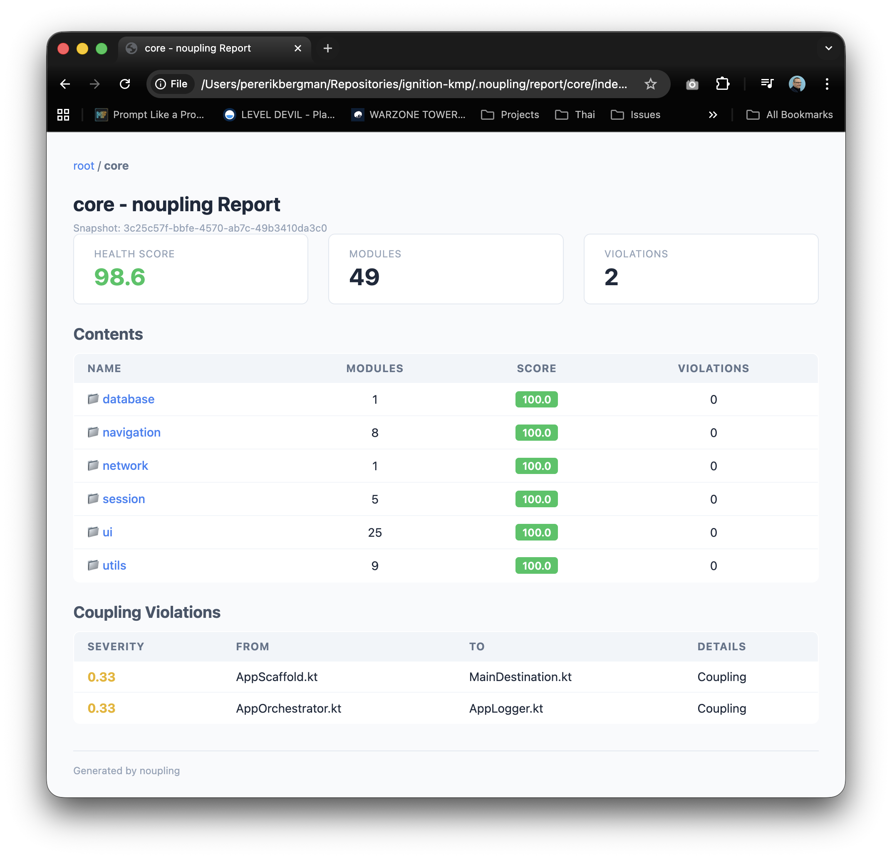

<p align="center">
  <h1 align="center">noupling</h1>
  <p align="center">
    <strong>Detect coupling violations and circular dependencies in your codebase.</strong>
  </p>
  <p align="center">
    <a href="https://github.com/pererikbergman/noupling/actions/workflows/ci.yml"></a>
    <a href="https://github.com/pererikbergman/noupling/blob/main/LICENSE"></a>
    
    
  </p>
</p>

---

## Why noupling?

Most linters check code style. **noupling checks architecture.**

It scans your project, builds a dependency graph from actual import statements, and quantifies how coupled your modules are. It finds:

- **Coupling violations** - sibling modules that depend on each other, breaking architectural boundaries
- **Circular dependencies** - dependency chains that form loops (A -> B -> C -> A), preventing independent development and testing

Every violation gets a **severity score** based on depth: problems at the root of your project hit harder than deep in a leaf package. The result is a single **health score (0-100)** you can track over time and gate in CI.

### Key Features

- **11 languages**: C#, Go, Haskell, Java, JavaScript, Kotlin, Python, Rust, Swift, TypeScript, Zig
- **Tree-sitter parsing**: Fast, accurate AST-based import extraction (no regex)
- **Parallel scanning**: Rayon-powered file discovery and parsing
- **6 report formats**: JSON, XML, Markdown, HTML, SonarCloud
- **Interactive HTML report**: Kover-style drill-down with color-coded scores
- **PR/CI mode**: `--diff-base main` to only flag new violations
- **Configurable**: Thresholds, glob ignore patterns, source extensions

<p align="center">
  
</p>

---

## Quick Start

```bash
# Install
cargo install --path .

# Scan your project
noupling scan /path/to/project

# See the health score
noupling audit /path/to/project

# Generate an interactive HTML report
noupling report /path/to/project --format html
```

---

## Installation

### From source

```bash
git clone https://github.com/pererikbergman/noupling.git
cd noupling
cargo install --path .
```

### Prebuilt binaries

Download from [GitHub Releases](https://github.com/pererikbergman/noupling/releases). Available for Linux (x86_64, aarch64), macOS (Apple Silicon, Intel), and Windows.

---

## Usage

### Scan a project

```bash
noupling scan /path/to/project
```

Discovers source files, parses imports via Tree-sitter, and stores the dependency graph in `.noupling/history.db`.

### Audit for violations

```bash
noupling audit /path/to/project
```

Displays a health score (0-100), coupling violations sorted by severity, and circular dependencies grouped by cycle order.

### Generate reports

```bash
noupling report /path/to/project --format json    # Comprehensive JSON
noupling report /path/to/project --format xml     # Comprehensive XML
noupling report /path/to/project --format md      # Multi-file navigable Markdown
noupling report /path/to/project --format html    # Interactive HTML with drill-down
noupling report /path/to/project --format sonar   # SonarCloud generic issue import
```

### Diff mode (PR/CI gate)

Only report violations from files changed compared to a base branch:

```bash
noupling scan /path/to/project --diff-base main
noupling audit /path/to/project
```

Scans the full project for import resolution but filters results to changed files only. Use this in CI to fail PRs only on **new** issues.

---

## CI/CD Integration

### GitHub Actions

```yaml
- name: Install noupling
  run: cargo install --path .

- name: Scan (diff mode)
  run: noupling scan . --diff-base origin/main

- name: Audit
  run: noupling audit .

- name: Generate Sonar report
  run: noupling report . --format sonar
```

### SonarCloud

Generate the generic issue import file and reference it in your Sonar config:

```bash
noupling report . --format sonar
```

Add to `sonar-project.properties`:

```properties
sonar.externalIssuesReportPaths=.noupling/noupling-sonar.json
```

---

## Configuration

Settings are stored in `.noupling/settings.json` (auto-created on first run):

```json
{
  "thresholds": {
    "score_green": 90.0,
    "score_yellow": 70.0,
    "critical_severity": 0.5,
    "minimum_severity": 0.2
  },
  "ignore_patterns": [
    "**/.git/**",
    "**/build/**",
    "**/generated/**",
    "**/node_modules/**"
  ],
  "source_extensions": [
    "rs", "kt", "java", "ts", "py", "swift", "cs",
    "go", "hs", "js", "jsx", "kts", "tsx", "zig"
  ]
}
```

| Setting | Description | Default |
| :--- | :--- | :--- |
| `score_green` | Score threshold for "healthy" (green) | 90.0 |
| `score_yellow` | Score threshold for "warning" (yellow) | 70.0 |
| `critical_severity` | Violations above this are flagged critical | 0.5 |
| `minimum_severity` | Hide violations below this (reduce noise) | 0.2 |
| `ignore_patterns` | Glob patterns for dirs/files to skip | 15 defaults |
| `source_extensions` | File types to scan | 14 extensions |

---

## How It Works

1. **Scan**: Discover source files, parse imports with Tree-sitter, resolve to project paths
2. **Store**: Persist modules and dependencies in SQLite (`.noupling/history.db`)
3. **Analyze**:
   - **D_acc**: For each directory, compute the union of all external dependencies from its subtree
   - **BFS**: Walk the tree top-down, checking sibling pairs for coupling
   - **Cycles**: Find circular dependencies among siblings at each level
4. **Score**: `Health = 100 * (1 - sum_severity / total_modules)`

Coupling severity: `1 / (depth + 1)` - root-level coupling is severe, deep coupling is mild.

Circular severity: `modules / (depth + 1) / 10` - always significant, amplified near the root.

See [docs/architecture.md](docs/architecture.md) for the full technical details.

---

## Supported Languages

| Language | Extensions | Import Pattern |
| :--- | :--- | :--- |
| C# | `.cs` | `using` directives |
| Go | `.go` | `import` declarations |
| Haskell | `.hs` | `import` declarations |
| Java | `.java` | `import` declarations |
| JavaScript | `.js`, `.jsx` | ES `import` statements |
| Kotlin | `.kt`, `.kts` | `import` declarations |
| Python | `.py` | `import` / `from...import` |
| Rust | `.rs` | `use` declarations |
| Swift | `.swift` | `import` declarations |
| TypeScript | `.ts`, `.tsx` | ES `import` statements |
| Zig | `.zig` | `@import()` builtins |

---

## Contributing

See [CONTRIBUTING.md](CONTRIBUTING.md) for build instructions, coding standards, branching strategy, and how to add a new language parser.

## Security

If you discover a security vulnerability, please report it privately via [GitHub Security Advisories](https://github.com/pererikbergman/noupling/security/advisories).

## License

[MIT](LICENSE)
